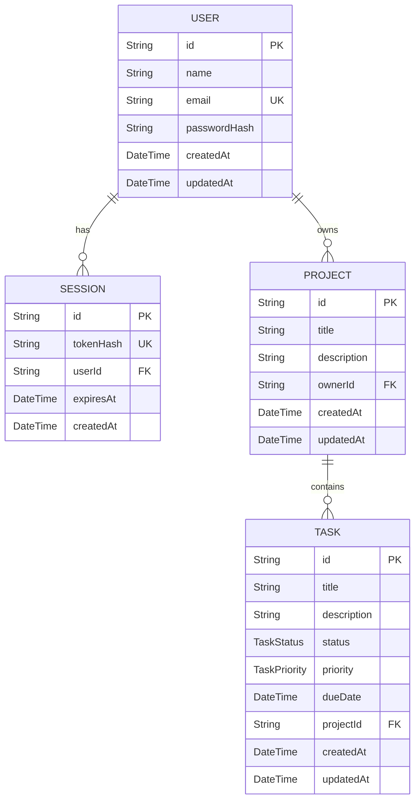

# TaskFlow REST API – Projektplanung

## 1. Projektzweck

TaskFlow ist eine REST-API zur Verwaltung persönlicher Projekte und ihrer Aufgaben.

Registrierte Benutzer:innen können Projekte erstellen, Aufgaben planen, ihren Bearbeitungsstatus verwalten und Aufgaben anhand verschiedener Kriterien suchen und filtern.

Die API richtet sich in der aktuellen Version an Einzelpersonen, die ihre Arbeit strukturiert organisieren möchten. Eine spätere Erweiterung für Teams ist möglich, gehört aber nicht zum MVP.

## 2. Problem und Lösung

Aufgaben werden häufig in verschiedenen Notizen oder Anwendungen verteilt gespeichert. Dadurch gehen Prioritäten, Fristen und der aktuelle Bearbeitungsstatus schnell verloren.

TaskFlow bietet dafür eine zentrale API:

- Projekte anlegen und verwalten
- Aufgaben einem Projekt zuordnen
- Status, Priorität und Fälligkeitsdatum speichern
- Aufgaben suchen, filtern und seitenweise abrufen
- Daten vor dem Zugriff anderer Benutzer:innen schützen

## 3. MVP-Funktionen

Die erste vollständige Version unterstützt:

- Registrierung, Login und Logout
- Abruf des aktuell angemeldeten Benutzers
- serverseitige Sessions über sichere Cookies
- CRUD-Operationen für Projekte
- CRUD-Operationen für Aufgaben
- Aufgabenstatus und Prioritäten
- Suche, Filterung und Pagination
- Zugriff ausschließlich auf eigene Projekte und Aufgaben
- Eingabevalidierung mit Zod
- einheitliche JSON-Fehlerantworten
- CORS, Security Header und Rate Limiting
- automatisierte Integrationstests
- Deployment mit PostgreSQL und HTTPS

Nicht zum MVP gehören:

- Workspaces und Teams
- Einladungen und unterschiedliche Benutzerrollen
- Kommentare und Benachrichtigungen
- Datei-Uploads
- Passwort-Zurücksetzen
- E-Mail-Verifizierung

Diese Funktionen können später ergänzt werden, wenn das MVP vollständig funktioniert.

## 4. Datenmodell

### User

Speichert das Benutzerkonto.

- `id`: UUID, Primärschlüssel
- `name`: Name
- `email`: eindeutige E-Mail-Adresse
- `passwordHash`: Argon2-Passworthash
- `createdAt`: Erstellungszeitpunkt
- `updatedAt`: Zeitpunkt der letzten Änderung

### Session

Speichert eine aktive Anmeldung. Der rohe Session-Token wird nicht in der Datenbank gespeichert.

- `id`: UUID, Primärschlüssel
- `tokenHash`: SHA-256-Hash des Session-Tokens
- `userId`: Fremdschlüssel zum User
- `expiresAt`: Ablaufzeitpunkt
- `createdAt`: Erstellungszeitpunkt

### Project

Speichert ein Projekt eines Benutzers.

- `id`: UUID, Primärschlüssel
- `title`: Projekttitel
- `description`: optionale Beschreibung
- `ownerId`: Fremdschlüssel zum Besitzer
- `createdAt`: Erstellungszeitpunkt
- `updatedAt`: Zeitpunkt der letzten Änderung

### Task

Speichert eine Aufgabe innerhalb eines Projekts.

- `id`: UUID, Primärschlüssel
- `title`: Aufgabentitel
- `description`: optionale Beschreibung
- `status`: `TODO`, `IN_PROGRESS` oder `DONE`
- `priority`: `LOW`, `MEDIUM` oder `HIGH`
- `dueDate`: optionales Fälligkeitsdatum
- `projectId`: Fremdschlüssel zum Projekt
- `createdAt`: Erstellungszeitpunkt
- `updatedAt`: Zeitpunkt der letzten Änderung

## 5. Beziehungen und ER-Diagramm

- Ein User kann mehrere Sessions besitzen.
- Eine Session gehört genau einem User.
- Ein User kann mehrere Projects besitzen.
- Ein Project gehört genau einem User.
- Ein Project kann mehrere Tasks enthalten.
- Ein Task gehört genau einem Project.
- Beim Löschen eines Users werden seine Sessions und Projekte gelöscht.
- Beim Löschen eines Projects werden seine Tasks gelöscht.



## 6. Geplante API-Endpunkte

### System

| Methode | Endpoint      | Zugriff    | Zweck                 |
| ------- | ------------- | ---------- | --------------------- |
| GET     | `/api/health` | öffentlich | Status der API prüfen |

### Authentifizierung

| Methode | Endpoint             | Zugriff    | Zweck                                |
| ------- | -------------------- | ---------- | ------------------------------------ |
| POST    | `/api/auth/register` | öffentlich | Benutzerkonto erstellen              |
| POST    | `/api/auth/login`    | öffentlich | Anmelden und Session-Cookie erhalten |
| GET     | `/api/auth/me`       | geschützt  | Aktuellen Benutzer abrufen           |
| POST    | `/api/auth/logout`   | geschützt  | Session löschen und abmelden         |

### Projekte

| Methode | Endpoint                   | Zugriff   | Zweck                         |
| ------- | -------------------------- | --------- | ----------------------------- |
| POST    | `/api/projects`            | geschützt | Projekt erstellen             |
| GET     | `/api/projects`            | geschützt | Eigene Projekte abrufen       |
| GET     | `/api/projects/:projectId` | geschützt | Eigenes Projekt abrufen       |
| PATCH   | `/api/projects/:projectId` | geschützt | Eigenes Projekt aktualisieren |
| DELETE  | `/api/projects/:projectId` | geschützt | Eigenes Projekt löschen       |

### Aufgaben

| Methode | Endpoint                                 | Zugriff   | Zweck                           |
| ------- | ---------------------------------------- | --------- | ------------------------------- |
| POST    | `/api/projects/:projectId/tasks`         | geschützt | Aufgabe erstellen               |
| GET     | `/api/projects/:projectId/tasks`         | geschützt | Aufgaben eines Projekts abrufen |
| GET     | `/api/projects/:projectId/tasks/:taskId` | geschützt | Einzelne Aufgabe abrufen        |
| PATCH   | `/api/projects/:projectId/tasks/:taskId` | geschützt | Aufgabe aktualisieren           |
| DELETE  | `/api/projects/:projectId/tasks/:taskId` | geschützt | Aufgabe löschen                 |

Die Aufgabenliste unterstützt folgende Query-Parameter:

- `status`: `TODO`, `IN_PROGRESS` oder `DONE`
- `priority`: `LOW`, `MEDIUM` oder `HIGH`
- `search`: Suche in Titel und Beschreibung
- `page`: Seitennummer, standardmäßig `1`
- `limit`: Anzahl pro Seite, standardmäßig `10`, maximal `100`

Beispiel:

```http
GET /api/projects/{projectId}/tasks?status=TODO&priority=HIGH&search=api&page=1&limit=10
```

## 7. Beispielanfragen und Antworten

### Registrierung

```http
POST /api/auth/register
Content-Type: application/json
```

```json
{
  "name": "Ahmad",
  "email": "ahmad@example.com",
  "password": "StrongPass123"
}
```

Erfolgreiche Antwort:

```json
{
  "success": true,
  "data": {
    "user": {
      "id": "e138993b-7fd5-433d-998d-09af54f88005",
      "name": "Ahmad",
      "email": "ahmad@example.com",
      "createdAt": "2026-10-01T11:49:50.198Z"
    }
  }
}
```

### Projekt erstellen

```http
POST /api/projects
Content-Type: application/json
Cookie: session_token=...
```

```json
{
  "title": "TaskFlow Backend",
  "description": "Backend module final project"
}
```

### Aufgabe erstellen

```http
POST /api/projects/{projectId}/tasks
Content-Type: application/json
Cookie: session_token=...
```

```json
{
  "title": "Complete API documentation",
  "description": "Document all endpoints and error responses",
  "status": "IN_PROGRESS",
  "priority": "HIGH",
  "dueDate": "2026-10-06T18:00:00.000Z"
}
```

### Paginierte Aufgabenliste

```json
{
  "success": true,
  "data": {
    "tasks": [],
    "pagination": {
      "page": 1,
      "limit": 10,
      "total": 0,
      "totalPages": 0
    }
  }
}
```

### Validierungsfehler

```json
{
  "success": false,
  "error": {
    "code": "VALIDATION_ERROR",
    "message": "The request body contains invalid data.",
    "details": [
      {
        "field": "title",
        "message": "Task title is required."
      }
    ]
  }
}
```

### Nicht authentifiziert

```json
{
  "success": false,
  "error": {
    "code": "UNAUTHENTICATED",
    "message": "Authentication is required."
  }
}
```

### Ressource nicht gefunden

```json
{
  "success": false,
  "error": {
    "code": "PROJECT_NOT_FOUND",
    "message": "Project not found."
  }
}
```

### Unbekannter Endpoint

```json
{
  "success": false,
  "error": {
    "code": "ROUTE_NOT_FOUND",
    "message": "Route not found."
  }
}
```

## 8. Authentifizierung und Autorisierung

TaskFlow verwendet eine selbst implementierte Session-Authentifizierung und keinen externen Auth-Anbieter.

Ablauf:

1. Das Passwort wird mit Argon2id gehasht.
2. Nach erfolgreicher Registrierung oder Anmeldung wird ein kryptografisch zufälliger Session-Token erzeugt.
3. In der Datenbank wird ausschließlich dessen SHA-256-Hash gespeichert.
4. Der rohe Token wird in einem `HttpOnly`-Cookie an den Client gesendet.
5. Geschützte Endpoints prüfen die Session und deren Ablaufzeit.
6. Projekt- und Aufgabenabfragen prüfen zusätzlich den Besitzer des Projekts.

Für fremde oder nicht vorhandene Ressourcen wird dieselbe `404`-Antwort verwendet. Dadurch wird nicht offengelegt, ob eine fremde Ressource existiert.

## 9. Sicherheitskonzept

Folgende Maßnahmen sind vorgesehen:

- Passwörter werden nicht im Klartext gespeichert.
- Session-Tokens werden nur gehasht gespeichert.
- Session-Cookies sind `HttpOnly`.
- In Produktion werden Cookies mit `Secure` übertragen.
- Eingaben und Parameter werden mit Zod validiert.
- JSON-Anfragen sind auf `10kb` begrenzt.
- Helmet setzt wichtige HTTP-Sicherheitsheader.
- CORS erlaubt nur konfigurierte Client-Adressen.
- Registrierung und Login besitzen ein strengeres Rate Limit.
- Weitere API-Endpunkte besitzen ein allgemeines Rate Limit.
- Interne Fehler und Stacktraces werden nicht an Clients gesendet.
- Geheimnisse werden ausschließlich über Umgebungsvariablen konfiguriert.
- `.env`-Dateien werden nicht im Repository veröffentlicht.
- Die bereitgestellte API verwendet HTTPS.

## 10. Technologie-Stack und Begründung

| Technologie        | Zweck               | Begründung                                                     |
| ------------------ | ------------------- | -------------------------------------------------------------- |
| Node.js            | JavaScript-Laufzeit | Gleiche Sprache im Frontend und Backend                        |
| Express            | REST-API            | Leicht verständlich, flexibel und im Kurs behandelt            |
| PostgreSQL         | Datenbank           | Geeignet für relationale Daten und Fremdschlüssel              |
| Prisma             | ORM und Migrationen | Typsichere Datenabfragen und nachvollziehbare Migrationen      |
| Zod                | Validierung         | Einheitliche Prüfung nicht vertrauenswürdiger Eingaben         |
| Argon2             | Passwort-Hashing    | Für sichere Passwortspeicherung entwickelt                     |
| Jest               | Test Runner         | Automatisierte und wiederholbare Tests                         |
| Supertest          | API-Tests           | HTTP-Endpunkte können ohne separaten Testserver geprüft werden |
| Helmet             | Security Header     | Setzt bewährte HTTP-Sicherheitsheader                          |
| cors               | CORS-Konfiguration  | Erlaubt nur vorgesehene Clients                                |
| express-rate-limit | Rate Limiting       | Schutz vor Missbrauch und zu vielen Anmeldeversuchen           |
| Git und GitHub     | Versionskontrolle   | Nachvollziehbare Entwicklung und Abgabe                        |

Die API verwendet JavaScript mit ECMAScript Modules. TypeScript wurde für das MVP nicht gewählt, damit der Fokus auf API-Design, Datenbank, Sicherheit und Tests bleibt.

## 11. Teststrategie

Automatisierte Integrationstests prüfen:

- Health-Endpoint
- Registrierung, Login, Benutzerabruf und Logout
- erfolgreiche und ungültige Anfragen
- geschützte Endpoints ohne Authentifizierung
- Projekt-CRUD
- Task-CRUD
- Eigentums- und Autorisierungsprüfungen
- Filterung, Suche und Pagination
- Security Header und CORS
- einheitliche `404`-Antworten

Für Tests wird eine separate PostgreSQL-Datenbank verwendet, damit Entwicklungsdaten nicht verändert werden.

## 12. Deployment-Plan

Die API wird mit einer verwalteten PostgreSQL-Datenbank bereitgestellt.

Für die Produktionsumgebung werden mindestens folgende Variablen benötigt:

- `DATABASE_URL`
- `PORT`
- `NODE_ENV=production`
- `CLIENT_ORIGINS`
- `API_RATE_LIMIT_MAX`
- `AUTH_RATE_LIMIT_MAX`

Nach dem Deployment werden Health-Endpoint, Authentifizierung sowie Projekt- und Aufgaben-Endpunkte über HTTPS getestet.

Die Live-URL wird nach erfolgreichem Deployment in die README-Datei eingetragen.
