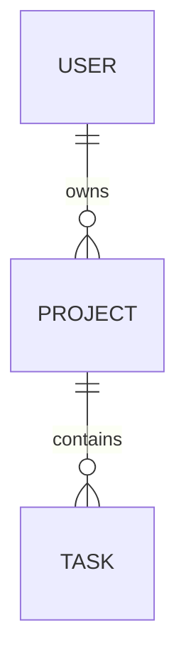

# TaskFlow REST API – Projektplanung

## 1. Projektzweck

TaskFlow ist eine REST-API zur Verwaltung von Projekten und Aufgaben.

Registrierte Benutzer:innen können eigene Projekte erstellen und die dazugehörigen Aufgaben verwalten. Die API richtet sich an Einzelpersonen und kleine Teams, die ihre Arbeit übersichtlich organisieren möchten.

## 2. MVP-Funktionen

Die erste vollständige Version unterstützt:

- Registrierung und Login
- Logout und Abruf des eigenen Profils
- CRUD für Projekte
- CRUD für Aufgaben
- Aufgabenstatus und Prioritäten
- Suche, Filterung und Pagination
- Zugriff ausschließlich auf eigene Daten
- Validierung und sichere Fehlerantworten
- automatisierte API-Tests
- Deployment mit PostgreSQL

Zusätzliche Funktionen wie Einladungen, Kommentare und Benachrichtigungen werden erst umgesetzt, wenn das MVP vollständig funktioniert.

## 3. Datenmodell

### User

- id
- name
- email
- passwordHash
- createdAt
- updatedAt

### Project

- id
- title
- description
- ownerId
- createdAt
- updatedAt

### Task

- id
- title
- description
- status
- priority
- dueDate
- projectId
- createdAt
- updatedAt

## 4. Beziehungen

- Ein User kann mehrere Projects besitzen.
- Ein Project gehört genau einem User.
- Ein Project kann mehrere Tasks enthalten.
- Ein Task gehört genau einem Project.

